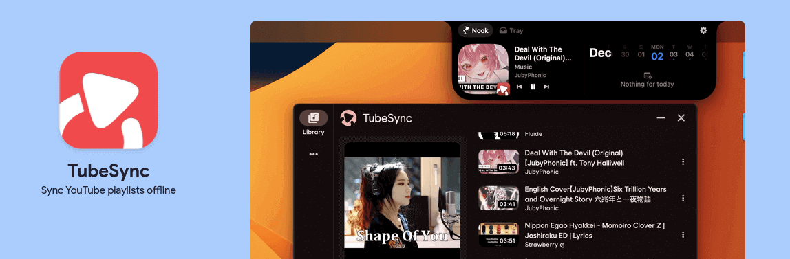
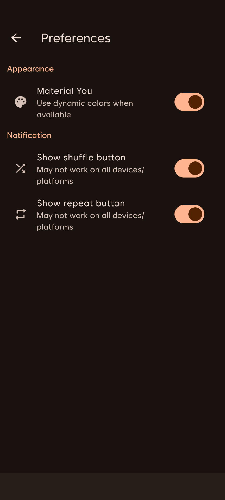
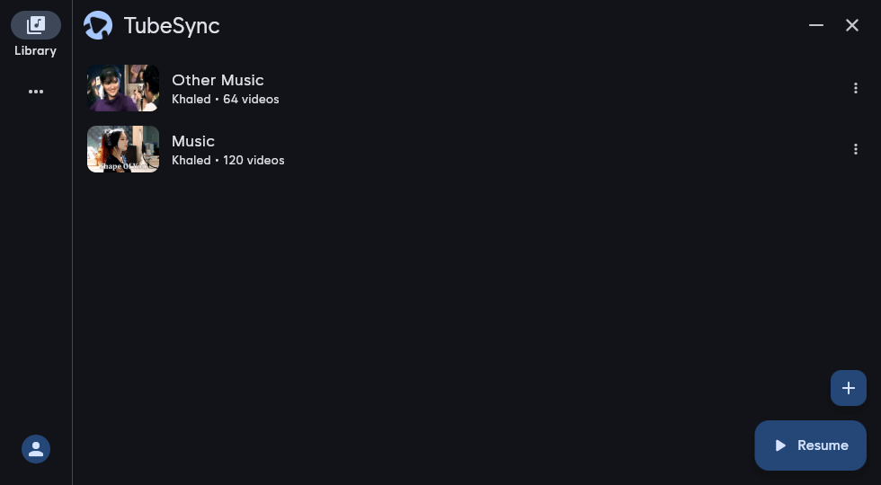
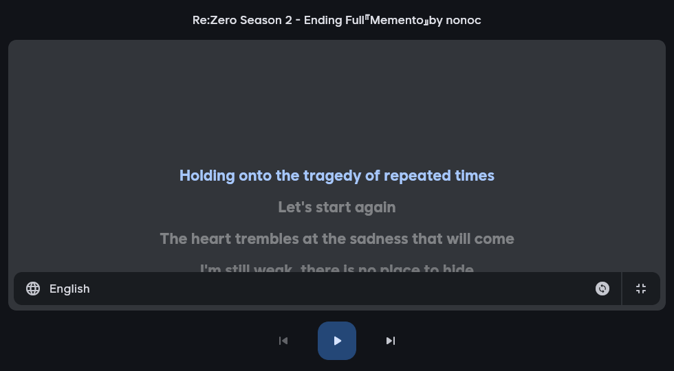
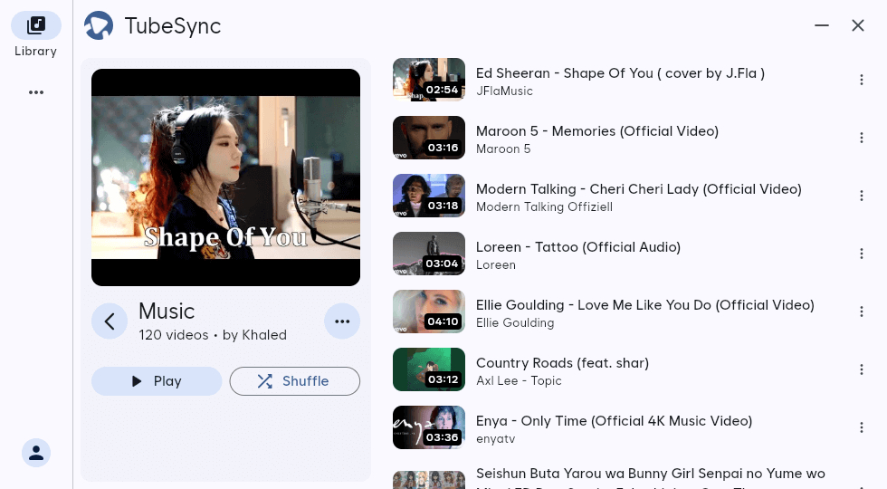
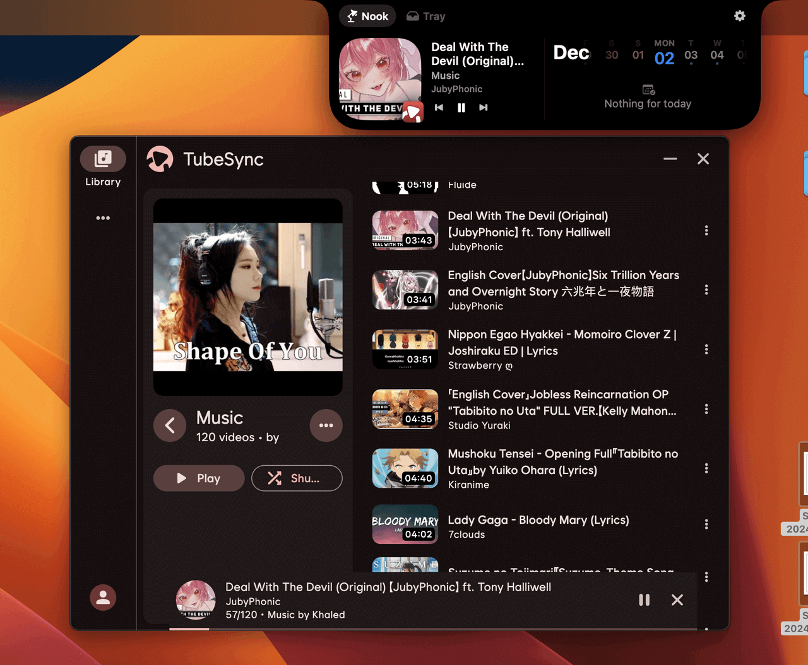

# [Syncara](https://syncara.app/)

Sync YouTube playlists offline. Because YT Music \<insert reason here\>

## Features

- Offline downloads
- Background playback
- Fluid gesture navigations
- Lyrics support
- Cross Platform (Android, IOS, MacOS, Linux and Windows)

## Look & Feel

- Follows modern material-3 interface design guidelines
- Adaptive and responsive layout
- Dark and Night mode support
- Matches your system color scheme automatically

### Mobile

  
  
  
  

### Desktop

 
  
  
  

## Download

Syncara for all platform are primarily released on Github. **Tap on your device icon to directly download.**

 

     
    
  
   

## Also available on your favourite app stores

### Android

 

  
  
  

### Linux

  

### iOS and MacOS

**IOS:** Unsigned (.ipa) builds are available. [Download (IOS) from here](https://github.com/khaled-0/Syncara/releases/latest/download/syncara_ios_unsigned.ipa).  
**Note:** Use [Sideloadly](https://sideloadly.io/) to install it.
Here's a [Video tutorial by @ilyassesalama](https://www.youtube.com/watch?v=r91iJ6KRcUs)

**MacOS**: Available directly as app (.app) [Download (MacOS) from here](https://github.com/khaled-0/Syncara/releases/latest/download/syncara_macos.zip)

  
Alternatively, you can try the nightly (unstable) build:

- [Latest nightly build link](https://nightly.link/khaled-0/Syncara/workflows/nightly/main)
- [Actions page for nightly builds](https://github.com/khaled-0/Syncara/actions)

## Special Thanks

- [@ilyassesalama](https://github.com/ilyassesalama) - For providing https://syncara.app
- [@PranavPurwar](https://github.com/PranavPurwar) - For building the homepage at https://syncara.app
- To all the open source devs for their wonderful libraries.
- And to the peoples involved with this project in various ways

## Star History

<a href="https://star-history.com/#khaled-0/Syncara&Date">
 <picture>
   <source media="(prefers-color-scheme: dark)" srcset="https://api.star-history.com/svg?repos=khaled-0/Syncara&type=Date&theme=dark" />
   <source media="(prefers-color-scheme: light)" srcset="https://api.star-history.com/svg?repos=khaled-0/Syncara&type=Date" />
   
 </picture>
</a>
